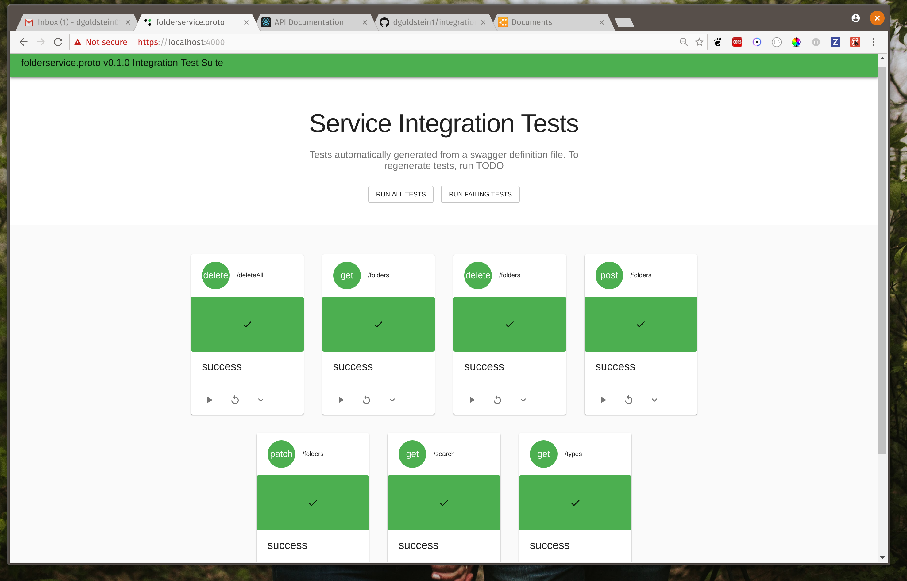

# Integration Test Generator


Integration test generator is a fast and convient way to create integration test against a swagger api. This project clones its sister project ui project [integration test generator ui](https://github.com/dgoldstein1/swagger-integration-test-UI) and then generates all the business logic wires up the app, in order to create automated tests

[](https://codeclimate.com/github/dgoldstein1/integration-test-generator/test_coverage)

[](https://codeclimate.com/github/dgoldstein1/integration-test-generator/maintainability)

## Planned features:

 - add ci pipeline

### Prerequisites

You will need 

- [Node JS](https://nodejs.org/en/)

## Installation and Usage

```sh
# clone the package
git clone https://github.com/dgoldstein1/integration-test-generator.git
# generate symbolic links
cd integration-test-generator
./create_symbolic_links.sh
# run the generator
cd some-backend-project-with-a-swagger-file
generateIntegrationTests
   --swagger=swagger.json --out=integrationtests
--endpoint=https://localhost:4000
--npmPackgeName=exemplarPlugin
```

This should create the app with tests in the directory you specified as `out`.

```sh
cd out # or directory you specified
# open up app
npm start 
``` 

You should be taken to a new screen with the project:



At this point you will need to update the templated tests in the `out/src/tests/` folder. For example, 

```js

return api["get"](endpoint + "/listSpaces", {}).then(res => {
  return Promise.resolve({
    success: _.isEqual(res.data, {
      count: "DYD",
      spaces: [
        {
          ID: "YrTCZYEJ",
          name: "ALeXKpX",
          creator: "zcaIGtyGIwZ",
          created: "ugCwMNYmZ",
          numberOfMembers: "hDQgaXZVOk"
        }
      ]
    })
  });
});
```

Will need to be adjusted to something like

```js

return api["get"](endpoint + "/listSpaces", {}).then(res => {
  return Promise.resolve({
    success: _.isEqual(res.data, {
      count: 0,
      spaces: [
        {
          ID: "20394207502360235",
          name: "This is a real name",
          creator: "David Goldstein",
          numberOfMembers: 15
        }
      ]
    })
  });
});

 ```

Continue this until your tests are passing! If your swagger.json file changes, you can update it using:

```sh
integration-test-generator -swagger swaggerfile -generateOnly true
```

Note that no existing test will be changed / updated / deleted.

## Unit Tests

Unit tests have pretty good coverage and are run on every commit to a remote branch. To run unit tests locally:

```sh
# from root directory of project
export ROOT_DIR=$(pwd)
npm test
```

## Docker 

As a simple React app, it is easy to make the generated integration tests into a docker image.

```sh
cd out # place where app was generated
docker built -f integration-tests . # create docker image 
```
Then mount the `out` directory into the container. For example, in docker-compose file this would look like:

```yml
integration-tests:
  image: integration-tests
  volumes:
    - './out:/usr/src/app'
  ports:
    - '3000:3000'
  environment:
    - NODE_ENV=development
```

## Authors

* **David Goldstein** - [DavidCharlesGoldstein.com](http://www.davidcharlesgoldstein.com/) - [Decipher Technology Studios](http://deciphernow.com/)

See also the list of [contributors](https://github.com/your/project/contributors) who participated in this project.

## License

This project is licensed under the Apache License - see the [license.md](LICENSE) file for details
